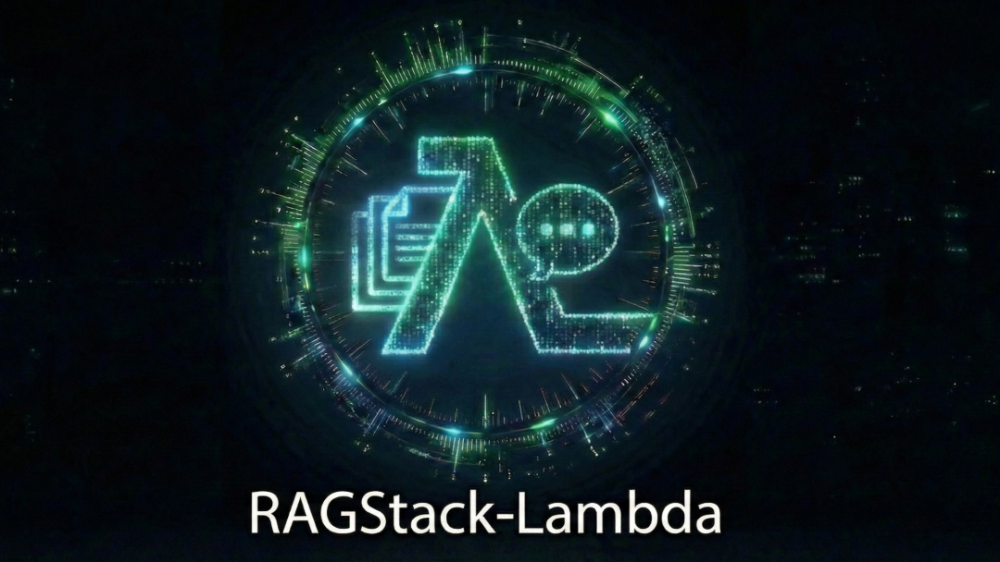

<p align="center">
<a href="https://www.apache.org/licenses/LICENSE-2.0.html"></a>
<a href="https://www.python.org/"></a>
<a href="https://react.dev"></a>
</p>

<p align="center">
<a href="https://aws.amazon.com/lambda/"></a>
<a href="https://aws.amazon.com/bedrock/"></a>
<a href="https://aws.amazon.com/transcribe/"></a>
<a href="https://aws.amazon.com/s3/"></a>
<a href="https://aws.amazon.com/dynamodb/"></a>
<a href="https://aws.amazon.com/cognito/"></a>
</p>

Serverless document and media processing with AI chat. Scale-to-zero architecture — no vector database fees, no idle costs. Upload documents, images, video, and audio — extract text with OCR or transcription — query using Amazon Bedrock or your AI assistant via MCP.

<p align="center">
  <b>QUESTIONS?</b>
  <a href="https://deepwiki.com/HatmanStack/RAGStack-Lambda/">
    <sub></sub>
  </a>
</p>

## Features

- ☁️ Fully serverless architecture (Lambda, Step Functions, S3, DynamoDB)
- 🧠 **NEW** Amazon Nova multimodal embeddings for text and image vectorization
- 📄 Document processing & vectorization (PDF, images, Office docs, HTML, CSV, JSON, XML, EML, EPUB) → stored in managed knowledge base
- 🎬 **NEW** Video/audio processing - transcribe speech with AWS Transcribe, searchable by timestamp
- 💬 AI chat with retrieval-augmented context and source attribution
- 📎 Collapsible source citations with optional document downloads
- ⏱️ **NEW** Media sources with timestamp links - click to play at exact position
- 🔍 Metadata filtering - auto-discover document metadata and filter search results
- 🎯 Relevancy boost for filtered results - prioritize matches from metadata filters
- 🔄 Knowledge Base reindex - regenerate metadata for existing documents with updated settings
- 🗑️ Document management - reprocess, reindex, or delete documents from the dashboard
- 🌐 Web component for any framework (React, Vue, Angular, Svelte)
- 🚀 One-click deploy
- 💰 $7-10/month (1000 docs, Textract + Haiku)

## Live Demo

| Environment | URL | Credentials |
|-------------|-----|-------------|
| **Base Pipeline** | [dhrmkxyt1t9pb.cloudfront.net](https://dhrmkxyt1t9pb.cloudfront.net/) | `guest@hatstack.fun` / `Guest@123` |
| **Project Showcase** | [showcase-htt.hatstack.fun](https://showcase-htt.hatstack.fun) | Login as guest |

> **Base Pipeline**: The core document processing tool - upload, OCR, and query documents.
>
> **Project Showcase**: See RAGStack powering a real application.

## Quick Start

### Option 1: One-Click Deploy (AWS Marketplace)

**REPO IS IN ACTIVE DEVELOPMENT AND WILL CHANGE OFTEN**

Deploy directly from the AWS Console - no local setup required:

1. [Subscribe to RAGStack on AWS Marketplace](https://aws.amazon.com/marketplace/pp/prodview-5afdiw2zrht6o) (free)
2. [Click here to deploy](https://us-east-1.console.aws.amazon.com/cloudformation/home?region=us-east-1#/stacks/create/review?templateURL=https://ragstack-quicklaunch-public.s3.us-east-1.amazonaws.com/ragstack-template.yaml&stackName=my-docs)
3. Enter a stack name (**lowercase only**, e.g., "my-docs") and your admin email
4. Click **Create Stack** (deployment takes ~10 minutes)

**After deployment:**
- Check your email for the temporary password (from Cognito)
- Go to CloudFormation → your stack → **Outputs** tab to find the Dashboard URL (`UIUrl`)

### Option 2: Deploy from Source

For customization or development:

**Prerequisites:**
- AWS Account with admin access
- Python 3.13+, Node.js 24+
- AWS CLI, SAM CLI (configured)
- Docker (for Lambda layer builds)

```bash
git clone https://github.com/HatmanStack/RAGStack-Lambda.git
cd RAGStack-Lambda

# Create virtual environment and install dependencies
python -m venv venv
source venv/bin/activate  # On Windows: venv\Scripts\activate
pip install -r requirements.txt

# Deploy (defaults to us-east-1 for Nova Multimodal Embeddings)
python publish.py \
  --project-name my-docs \
  --admin-email admin@example.com
```

### Option 3: Nested Stack Deployment

Deploy RAGStack as part of a larger CloudFormation stack. See [Nested Stack Deployment Guide](docs/NESTED_STACK_DEPLOYMENT.md) for details.

**Quick example:**
```yaml
Resources:
  RAGStack:
    Type: AWS::CloudFormation::Stack
    Properties:
      TemplateURL: https://ragstack-quicklaunch-public.s3.us-east-1.amazonaws.com/ragstack-template.yaml
      Parameters:
        StackPrefix: 'my-app-ragstack'  # Required: lowercase prefix
        AdminEmail: admin@example.com
```

## Web Component Integration

See [RAGSTACK_CHAT.md](docs/RAGSTACK_CHAT.md) for web component integration guide.

## API Access

**Server-side integrations** use API key authentication. Get your key from Dashboard → Settings.

```bash
curl -X POST 'YOUR_GRAPHQL_ENDPOINT' \
  -H 'x-api-key: YOUR_API_KEY' \
  -H 'Content-Type: application/json' \
  -d '{"query": "query { searchKnowledgeBase(query: \"...\") { results { content } } }"}'
```

**Web component** uses IAM auth (no API key needed - handled automatically).

Each UI tab shows server-side API examples in an expandable section.

## MCP Server (AI Assistant Integration)

Use your knowledge base directly in Claude Desktop, Cursor, VS Code, Amazon Q CLI, and other MCP-compatible tools.

```bash
# Install (or use uvx for zero-install)
pip install ragstack-mcp
```

Add to your AI assistant's MCP config:

```json
{
  "ragstack-kb": {
    "command": "uvx",
    "args": ["ragstack-mcp"],
    "env": {
      "RAGSTACK_GRAPHQL_ENDPOINT": "YOUR_ENDPOINT",
      "RAGSTACK_API_KEY": "YOUR_API_KEY"
    }
  }
}
```

Then ask naturally: *"Search my knowledge base for authentication docs"*

See [MCP Server docs](src/ragstack-mcp/README.md) for full setup instructions.

## Architecture

```
Upload → OCR → Embeddings → Bedrock KB
                                ↓
 Web UI (Dashboard + Chat) ←→ GraphQL API
                                ↓
 Web Component ←→ AI Chat with Sources
```

## Usage

### Documents
Upload documents in various formats. Auto-detection routes to optimal processor:

| Type | Formats | Processing |
|------|---------|------------|
| **Text** | HTML, TXT, CSV, JSON, XML, EML, EPUB, DOCX, XLSX | Direct extraction with smart analysis |
| **OCR** | PDF, JPG, PNG, TIFF, GIF, BMP, WebP, AVIF | Textract or Bedrock vision OCR (WebP/AVIF require Bedrock) |
| **Media** | MP4, WebM, MP3, WAV, M4A, OGG, FLAC | AWS Transcribe → 30s segments → searchable with timestamps |
| **Passthrough** | Markdown (.md) | Direct copy |

Processing time: UPLOADED → PROCESSING → INDEXED (typically 1-5 min for text, 2-15 min for OCR, 5-20 min for media)

### Images
Upload JPG, PNG, GIF, WebP with captions. Both visual content and caption text are searchable.

### Web Scraping
Scrape websites into the knowledge base. See [Web Scraping](docs/WEB_SCRAPING.md).

### Video & Audio
Upload MP4, WebM, MP3, WAV, M4A, OGG, or FLAC files. Speech is transcribed using AWS Transcribe and segmented into 30-second chunks for search. Sources include timestamps (e.g., "1:30-2:00") with clickable links that play at the exact position.

**Features:**
- Speaker diarization (identify who said what)
- Configurable language (30+ languages supported)
- Timestamp-linked sources in chat responses

See [Configuration](docs/CONFIGURATION.md#media-processing-videoaudio) for language and speaker settings.

### Chat
Ask questions about your content. Sources show where answers came from.

## Documentation

- [Configuration](docs/CONFIGURATION.md) - Settings, quotas, API keys & document management
- [Nested Stack Deployment](docs/NESTED_STACK_DEPLOYMENT.md) - Deploy as part of larger CloudFormation stack
- [Web Scraping](docs/WEB_SCRAPING.md) - Scrape websites
- [Metadata Filtering](docs/METADATA_FILTERING.md) - Auto-discover metadata and filter results
- [Chat Component](docs/RAGSTACK_CHAT.md) - Embed chat anywhere
- [Architecture](docs/ARCHITECTURE.md) - System design & API reference
- [Development](docs/DEVELOPMENT.md) - Local dev
- [Troubleshooting](docs/TROUBLESHOOTING.md) - Common issues
- [Library Reference](docs/LIBRARY_REFERENCE.md) - Public API for lib/ragstack_common

## Development

```bash
npm run check  # Lint + test all (backend + frontend)
```

## Deployment Options

### Direct Deployment

```bash
# Full deployment (defaults to us-east-1)
python publish.py --project-name myapp --admin-email admin@example.com

# Skip dashboard build (still builds web component)
python publish.py --project-name myapp --admin-email admin@example.com --skip-ui

# Skip ALL UI builds (dashboard and web component)
python publish.py --project-name myapp --admin-email admin@example.com --skip-ui-all

# Enable demo mode (rate limits: 5 uploads/day, 30 chats/day; disables reindex/reprocess/delete)
python publish.py --project-name myapp --admin-email admin@example.com --demo-mode
```

### Publish to AWS Marketplace (Maintainers)

To update the one-click deploy template:

```bash
python publish.py --publish-marketplace
```

This packages the application and uploads to S3 for one-click deployment.

> **Note:** Currently requires us-east-1 (Nova Multimodal Embeddings). When available in other regions, use `--region <region>`.

## Acknowledgments

This project was inspired by:

- [Accelerated Intelligent Document Processing on AWS](https://github.com/aws-solutions-library-samples/accelerated-intelligent-document-processing-on-aws) - AWS Solutions Library reference architecture
- [docs-mcp-server](https://github.com/arabold/docs-mcp-server) - MCP server for documentation search
